# Supplementary Page for "A Unified framework based on Unsupervised Convolutional Neural Networks for Hybrid Affine-Deformable Image registration"

----

## Registration output examples where proposed ARN performs better than SITK linear registration  

First row: ARN output in coronal and sagittal views. Second row: SITK output in coronal and sagittal views

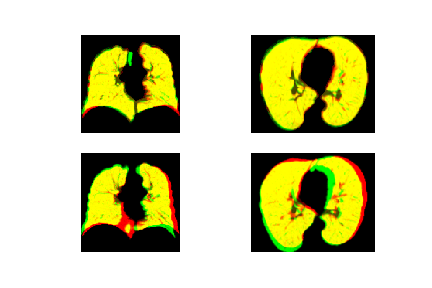

----

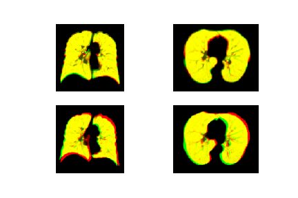

----

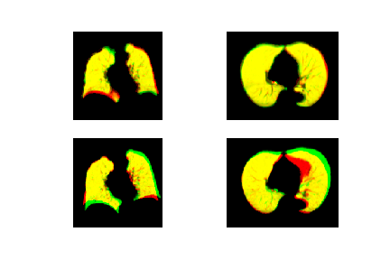

----

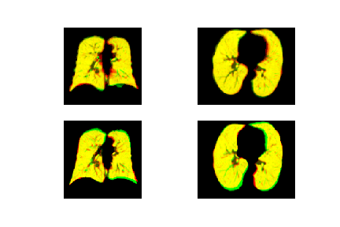

----

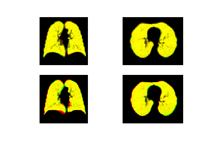

----

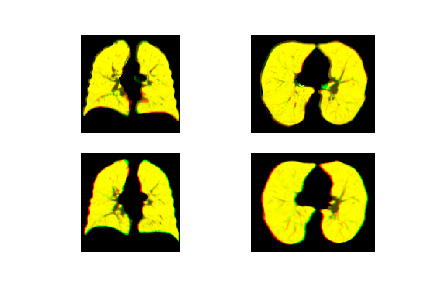

----

##  Examples where Dice of lung area after registration is low

**Affine registration results are often poor when lungs of fixed and moving images have huge difference, or when lung segmentation is not ideal.** 

**In each section:**

|First image|Second image|
|----|----|
|First row: coronal and sagittal views of fixed image with lung segmentation|First row: ARN output in coronal and sagittal views|
|Second row: coronal and sagittal views of moving image with lung segmentation|Second row: SITK output in coronal and sagittal views|

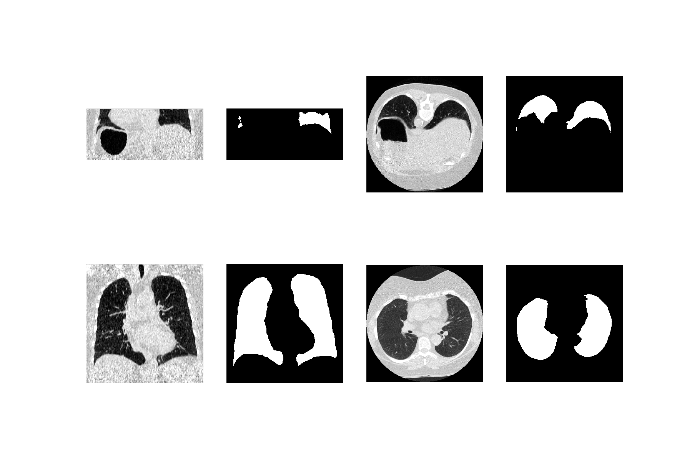

----

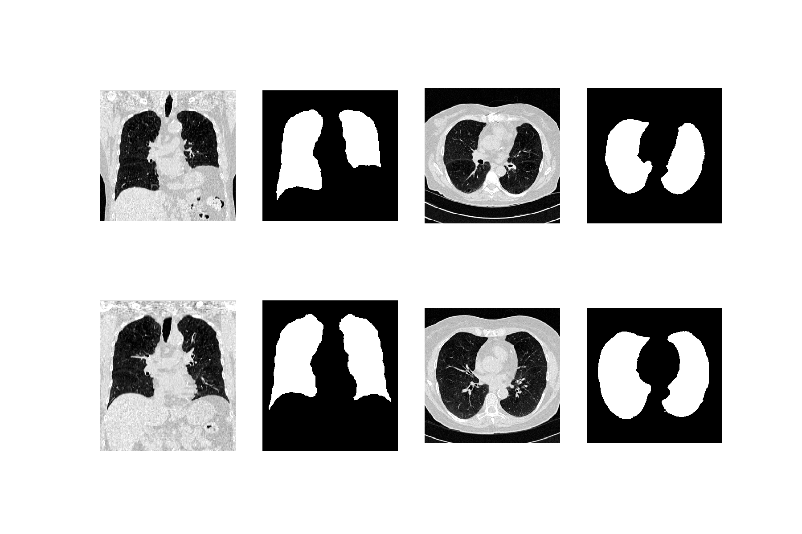
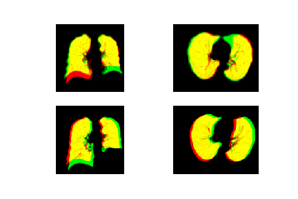

----

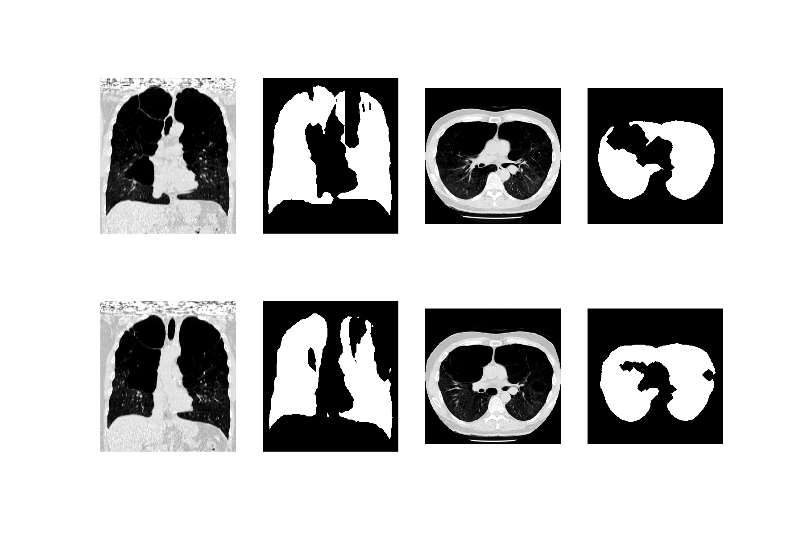
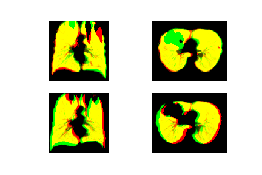

----

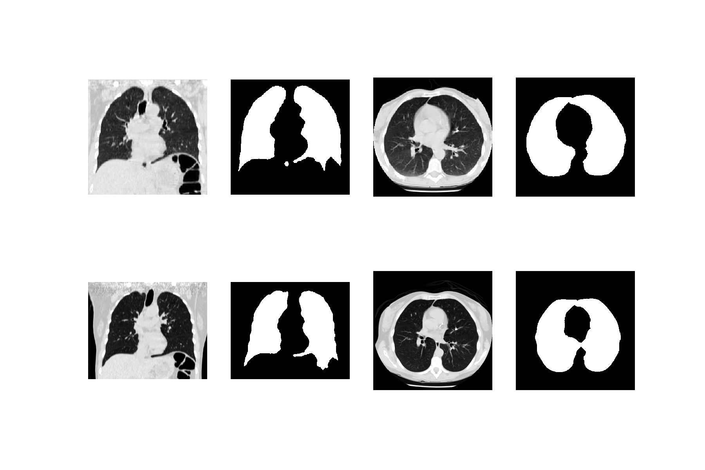
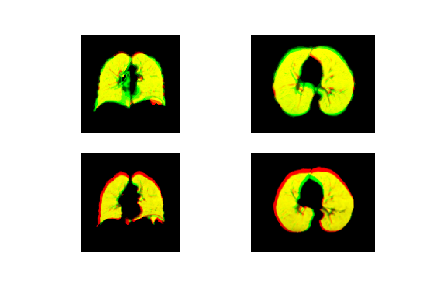

----

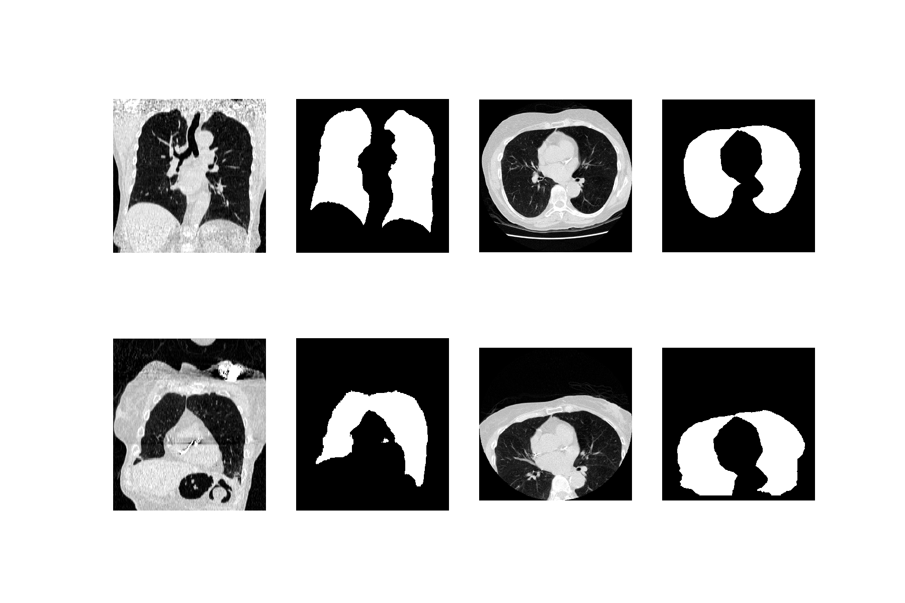
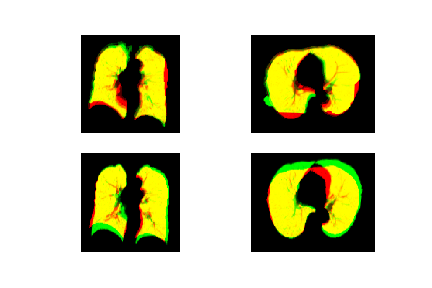

----

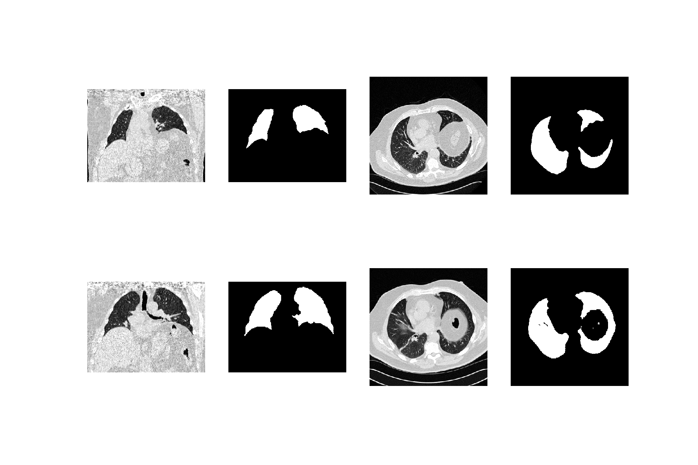
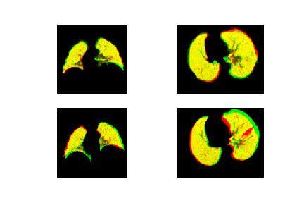

----

