# Supplementary Page for "A Unified framework based on Unsupervised Convolutional Neural Networks for Hybrid Affine-Deformable Image registration"

----

ARN: Affine registration network 

DRN: Deformable registration network

Hybrid model: ARN+DRN

## A  Hybrid Affine-Deformable Pipeline

Application of the proposed hybrid registration model to chest CT scans. The following figure shows the image pairs before registration, after affine registration, after the hybrid affine-deformable registration. We have also shown the the magnitude of the displacement field for the deformable  registration in the last column. 

||Before registration|After ARN|After ARN+DRN|DRN Flow Field|
|----|----|----|----|----|
|Patient 1|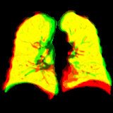|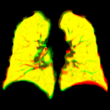|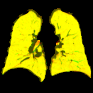|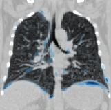|
|Patient 2|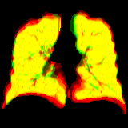|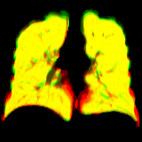|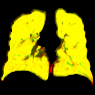|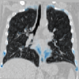|
|Patient 3|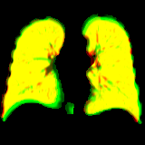|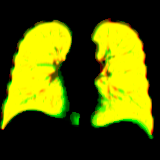|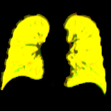|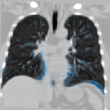|
|Patient 4|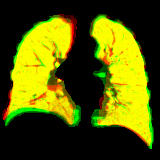|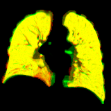|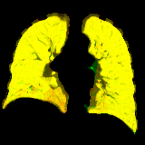|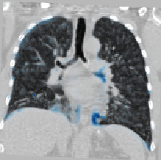|
|Patient 5|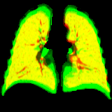|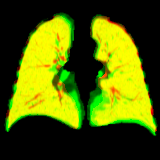|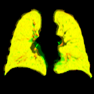|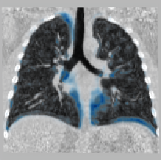|
|Patient 6|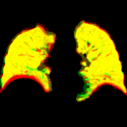|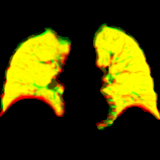|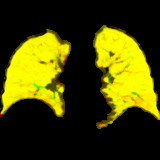|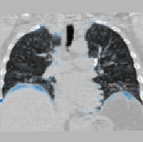|
|Patient 7|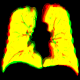|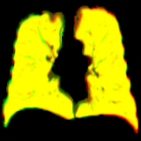|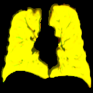|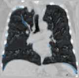|
|Patient 8|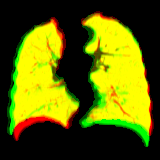|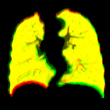|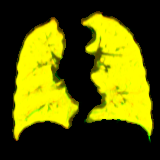|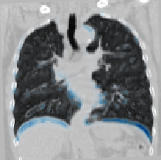|
|Patient 9|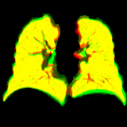|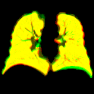|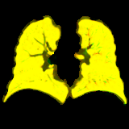|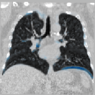|
|Patient 10|||||

----

## ARN vs SITK
The following figure hsows a head-to-head comparison between the proposed ARN and the commonly used affine registration method from the SITK library. As seen, the ARN outperforms SITK qualitatively (please see the paper for quantitative comparisons). It might be possible for the affine registration to diverge when the images are already in good alignment, as seen in patient 4, in which case ARN exhibits more stable and robust performance.

||**Before registration**|**SITK**|**ARN**|**Before registration**|**SITK**|**ARN**|
|----|----|----|----|----|----|----|
|Patient 1||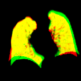|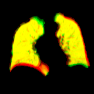|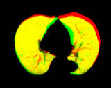|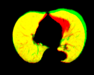|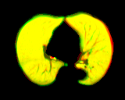|
|Patient 2|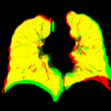|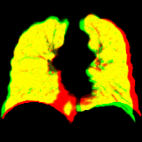|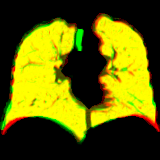|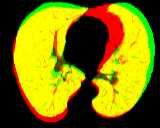|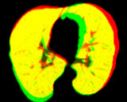|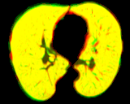|
|Patient 3|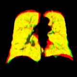|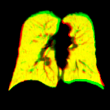|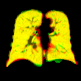||||
|Patient 4|||||||
|Patient 5|||||||
|Patient 6|||||||

|SITK Setup|
|----|
|Sitk Affine registration is configured to opimize Mattes mutual information with 50 histogram bins. Opitmization is done at 3 levels at 1/4, 1/2, and 1 of original scale. Each scale has a maximum step of 100.|

----

##  Challenging cases for registration

Lung Dice score after registration could be low when input cases are patients with incomplete and/or partial CT scans, or patients with severe pulmonary conditions where the lung areas show large lesions such as bulla or pneumothorax.

||**fixed coronal**|**moving coronal**|**fixed transversal**|**moving transversal**|**Comments**|
|----|----|----|----|----|----|
|Patient 1|||||Fixed image shows a partial scan where only a portion of the thorax is visible|
|Patient 2|||||Large bulla (black areas) coveing the lung areas in box fixed and moving images|
|Patient 3|||||The left lung in the fixed image appears small due to phrenic nerve paralysis|

<!--- 
||||||
|----|----|----|----|----|
||**fixed image coronal**|**fixed image transaxial**|**moving image coronal**|**moving image transaxial**|
|pair1 input|||||
||**ARN coronal view**|**SITK coronal view**|**ARN transaxial view**|**SITK transaxial view**|
|pair1 output|||||
||**fixed image coronal**|**fixed image transaxial**|**moving image coronal**|**moving image transaxial**|
|pair2 input|||||
||**ARN coronal view**|**SITK coronal view**|**ARN transaxial view**|**SITK transaxial view**|
|pair2 output|||||
||**fixed image coronal**|**fixed image transaxial**|**moving image coronal**|**moving image transaxial**|
|pair3 intput|||||
||**ARN coronal view**|**SITK coronal view**|**ARN transaxial view**|**SITK transaxial view**|
|pair3 output|||||
||**fixed image coronal**|**fixed image transaxial**|**moving image coronal**|**moving image transaxial**|
|pair4 input|||||
||**ARN coronal view**|**SITK coronal view**|**ARN transaxial view**|**SITK transaxial view**|
|pair4 output|||||
||**fixed image coronal**|**fixed image transaxial**|**moving image coronal**|**moving image transaxial**|
|pair5 input|||||
||**ARN coronal view**|**SITK coronal view**|**ARN transaxial view**|**SITK transaxial view**|
|pair5 output|||||
||**fixed image coronal**|**fixed image transaxial**|**moving image coronal**|**moving image transaxial**|
|pair6 input|||||
||**ARN coronal view**|**SITK coronal view**|**ARN transaxial view**|**SITK transaxial view**|
|pair6 output|||||
-->

