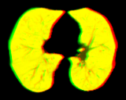
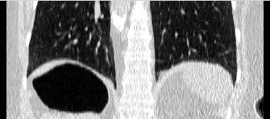
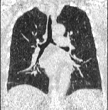
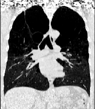
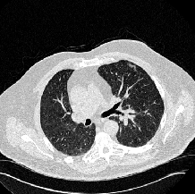

# Supplementary Page for "A Unified framework based on Unsupervised Convolutional Neural Networks for Hybrid Affine-Deformable Image registration"

----

## Registration output examples where proposed ARN performs better than SITK linear registration  

||ARN coronal view|SITK coronal view|ARN transaxial view|SITK transaxial view|
|----|||||
|pair 1|||||
|pair 2|||||
|pair 3|||||
|pair 4|||||
|pair 5|||||
|pair 6|||||

||
|---|
|Sitk Affine registration is configured to opimizes Mattes mutual information with 50 histogram bins. Opitmization is done at 3 levels at 1/4, 1/2, and 1 of original scale. Each scale have a maximum step of 100.|

----

##  Examples where Dice of lung area after registration is low

Affine registration results are often poor when lungs of fixed and moving images have large difference, or when lung segmentation is not ideal.

||||||
|:----|||||
||**fixed image coronal**|**fixed image transaxial**|**moving image coronal**|**moving image transaxial**|
|pair1 input|||||
||**ARN coronal view**|**SITK coronal view**|**ARN transaxial view**|**SITK transaxial view**|
|pair1 output|||||
||**fixed image coronal**|**fixed image transaxial**|**moving image coronal**|**moving image transaxial**|
|pair2 input|||||
||**ARN coronal view**|**SITK coronal view**|**ARN transaxial view**|**SITK transaxial view**|
|pair2 output|||||
||**fixed image coronal**|**fixed image transaxial**|**moving image coronal**|**moving image transaxial**|
|pair3 intput|||||
||**ARN coronal view**|**SITK coronal view**|**ARN transaxial view**|**SITK transaxial view**|
|pair3 output|||||
||**fixed image coronal**|**fixed image transaxial**|**moving image coronal**|**moving image transaxial**|
|pair4 input|||||
||**ARN coronal view**|**SITK coronal view**|**ARN transaxial view**|**SITK transaxial view**|
|pair4 output|||||
||**fixed image coronal**|**fixed image transaxial**|**moving image coronal**|**moving image transaxial**|
|pair5 input|||||
||**ARN coronal view**|**SITK coronal view**|**ARN transaxial view**|**SITK transaxial view**|
|pair5 output|||||
||**fixed image coronal**|**fixed image transaxial**|**moving image coronal**|**moving image transaxial**|
|pair6 input|||||
||**ARN coronal view**|**SITK coronal view**|**ARN transaxial view**|**SITK transaxial view**|
|pair6 output|||||

